# Strategy trading

This document is not financial advice, and does not provide any advice on strategy optimisation.

Use algorithmic trading at your own risk, consider paper trading first.

## Prerequisites

* A [3Commas account](https://3commas.io/?c=tc1052076)
* A [Tradingview account](https://www.tradingview.com/gopro/?share_your_love=sid-viscous) with at least the lowest paid subscription level
* [FW strategy](https://github.com/SKnight79/fwstrategy)

*Yes I put my referral links in there, get over it*

## 3 commas

### Creating a DCA bot
1. In 3commas, under the `Trading Bots` menu on the left go to the `DCA bot` dashboard.

2. Click on `Create DCA bot`

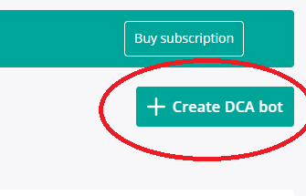

3. Select `Advanced` and create a new DCA bot

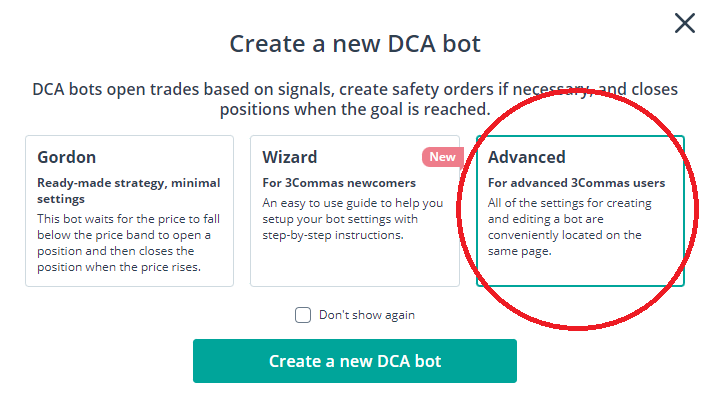

4. Under main settings, give your bot a name, select the exchange, and choose `Multi-pair`

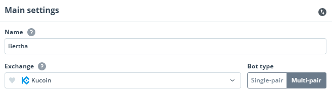

5. In the `Pairs` section, clear the default pairs and add all the pairs you want to trade with.

For long and short spot positions, use XXX3S / 3L coins.

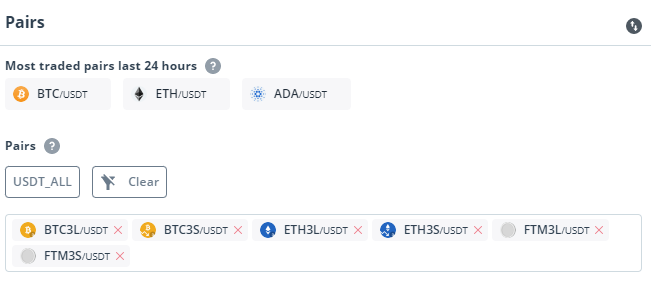

The 3commas free account only allows 1 DCA bot to be active at a time, therefore to capture multiple pairs, they will all need to be added.

This is not ideal because the TP and SL levels may not be the same for each pair, the minimum of all SLs and TPs should probably be selected. For example:

| Pair | Ideal TP | Ideal SL |
|---|---|---|
| BTCUSDT | 3% | 2% |
| ETHUSDT | 4% | 2.5% |
| FTMUSDT | 5% | 3% |

*Examples only, do not use these without researching ideal levels first.*

In this scenario, for a single multi-pair bot, the TP level should be 3% and SL should be 2%, even if other pairs may yield higher rewards. This is to avoid the BTCUSDT pair from hitting the SL too often 

Ideally, multiple bots would be used, each with their own TP and SL levels, however this requires the `Advanced` 3 commas subscription.

**IMPORTANT** The `stop loss timeout` feature is recommended to avoid being [SL hunted](https://www.investopedia.com/terms/s/stophunting.asp). Exchanges and whales like to deliberately force traders out of their trades by triggering SLs. The timeout feature can help prevent this. Check the market for ideal timeout times.

Take the following example

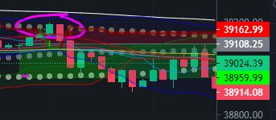

The strategy places a short order at 39108, the stop loss is at 39162. The price temporarily goes against the trade, exceeding the SL. In a normal trade this would close the deal immediately, however a stop loss timeout ensures that the deal is cancelled only when the price is beyond the SL for a set period of time.

6. For the deal start condition, select `Tradingview custom signal`

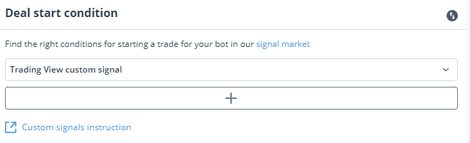

7. Set the TP and SL levels

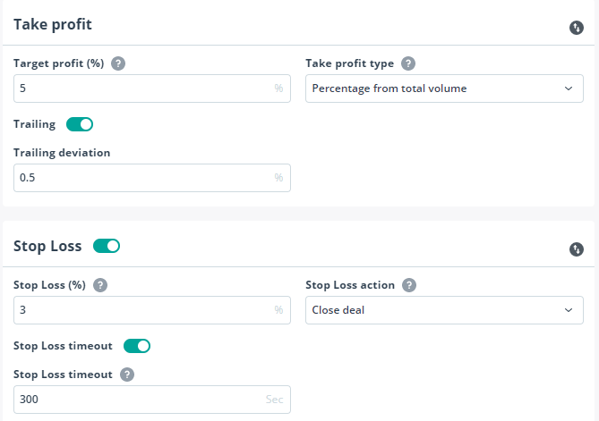

Consider carefully the TP and SL levels, make sure to back-test them (taking into account that the 3S/3L tokens will move more than the base coin).

The `Trailing` option configures the trailing take profit, with the deviation configuring the additional TP level for a small portion of the trade amount.

8. Set the safety orders

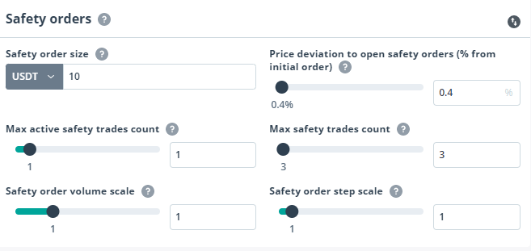

These are additional limit orders placed below the initial buy and are triggered when the price moves against your trade direction to purchase more coin.

9. Review the settings and click `Create Bot`

### Getting the bot details

To link the strategy to the bot, the email token and bot ID are required.

These can be found by navigating to the bot details page.

In the `DCA Bot` page, click on the bot name to go to the bot summary page, this should show all the details of the bot

Scroll to the bottom of this page, there will be several expandable links with details of the deal commands. Click on one of these to expand it

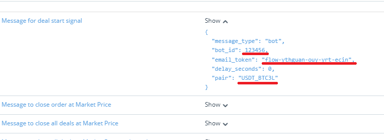

The following 2 pieces of information are needed: `bot_id`, `email_token`.

Also note the formatting of the `pair` attribute, use the format provided by 3Commas, even if this differs from what is normally seen on the exchange URLs.

## FW strategy

FW strategy is a pinescript strategy which creates buy and sell alerts. It can be deployed in Tradingview either on the website or the desktop application.

1. Copy all of the text from `FW Trading Strategy.pine.txt`

2. In the Tradingview app/website, click on `Pine Editor`
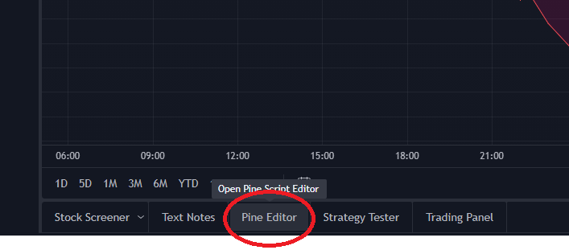

3. Paste the pinescript strategy into the pine editor and click `Add to chart`

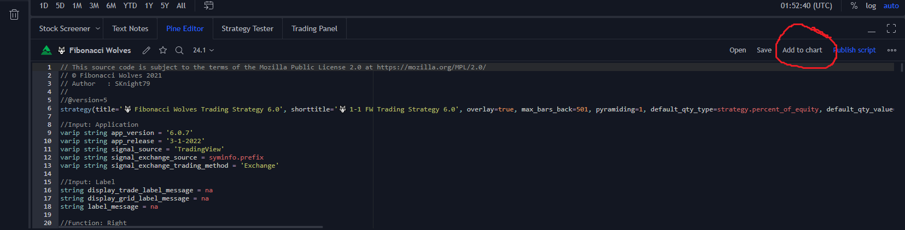

4. Choose the symbol pair and timeframe

5. Open the strategy configuration window

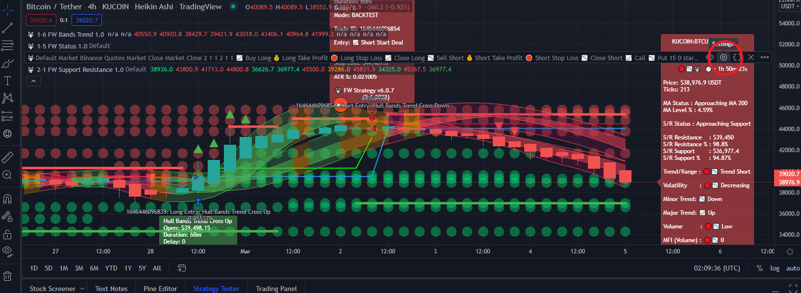

6. Configure the strategy, first by ticking `Close Long` and `Close Short` boxes

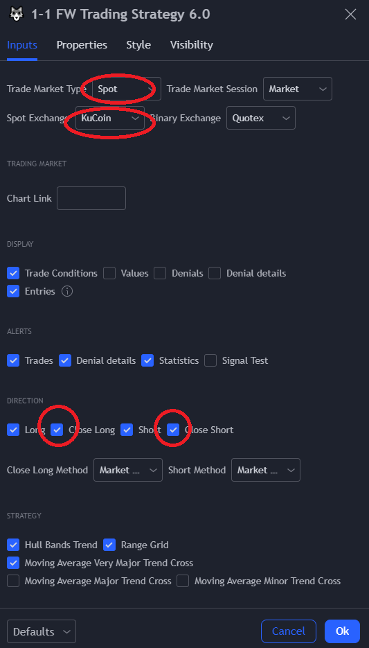

7. Adjust the SL and TP. TP commands will be ignored and are set at the 3Commas end. Adjusting these values is useful for backtesting, to find optimum levels for a given market.

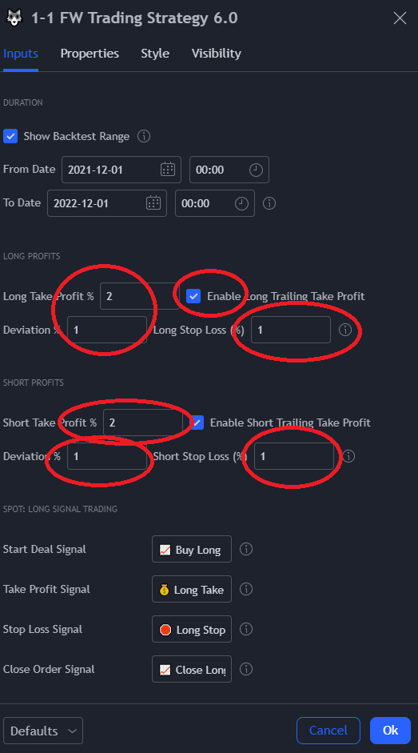

8. Configure the bot commands

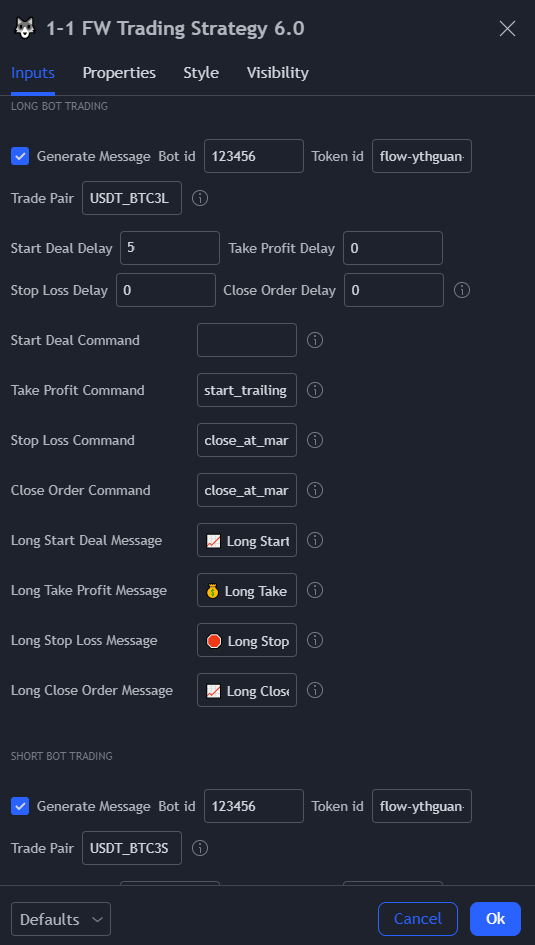

The `Bot id` and `Token id` from the 3Commas DCA bot should be entered here.

There is also the option to delay the entry by a number of seconds. Some time is required to allow reversal signals to stop before starting the new grid.

Do this for the Long and Short positions, placing the X3L coin in the Long trade pair, and X3S in the short trade pair.

9. Enable group messages and click `Ok`

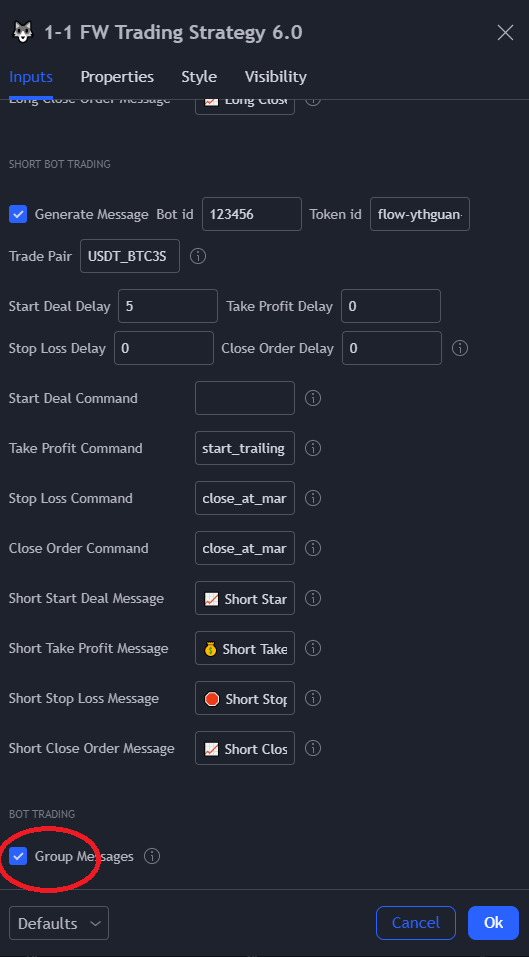

## Alerts

1. To create an alert, click on the ellipsis for the strategy

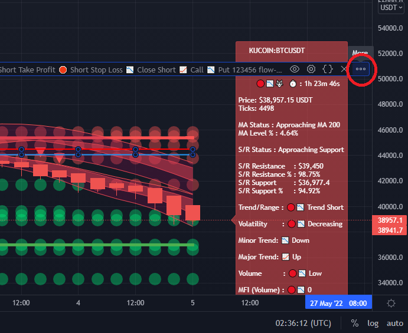

2. Modify the configuration

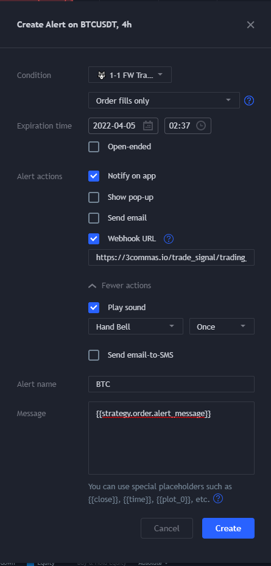

3. Set to `Order fills only`

4. Ensure the `Webhook URL` box is ticked, paste `https://3commas.io/trade_signal/trading_view` into the Webhook URL box

5. Add any other notifications you wish to receive when a trade is signalled.

6. Give a name to the alert

7. Enter `{{strategy.order.alert_message}}` Into the `Message` field. The `Message` is sent to the webhook URL, FW strategy automatically builds the messages for 3Commas.

8. Click `Create` and alerts will start to be sent to the webhook address when they are made. Ensure the DCA bot is switched on to make trades from the strategy.

## Telegram integration

It is useful to get logs of the DCA bot for events such as API key expiring, missing pairs, 

1. First, make sure you are logged into Telegram on the browser or desktop version.

2. To activate the Telegram bot, go to settings in 3Commas.

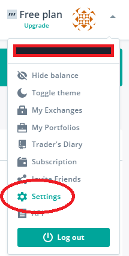

Scroll to the bottom of this page and click `Activate Telegram bot`.

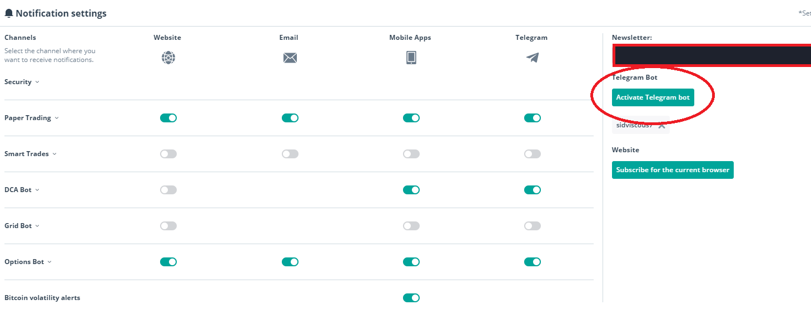

Then follow the instructions to subscribe to the bot. 

## Indicators

It is recommended at the very least that `FW Status`, `FW Bands Trend`, and `FW Support Resistance` are loaded alongside the strategy. These do not affect the strategy but help to visualise what conditions the strategy is considering and why.

## Tips

Get comfortable with the strategy, try different settings on back-testing, try it with paper trading first, and try it with very small orders to start with, to ensure your settings are optimal.

